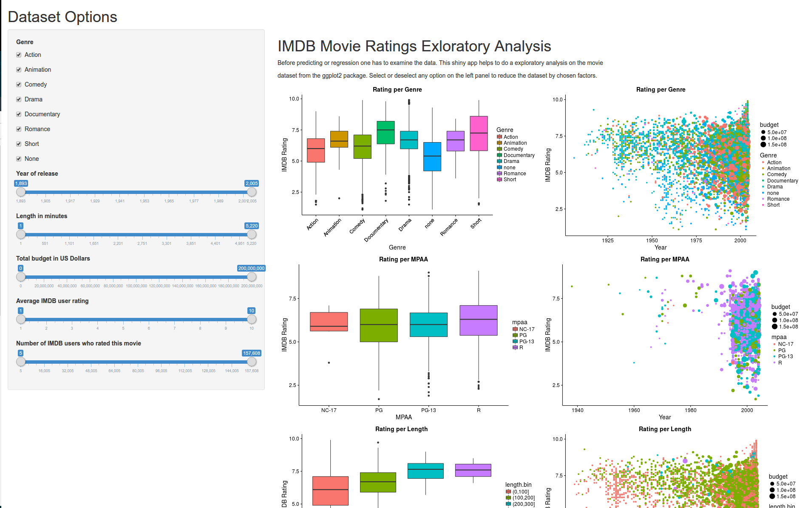
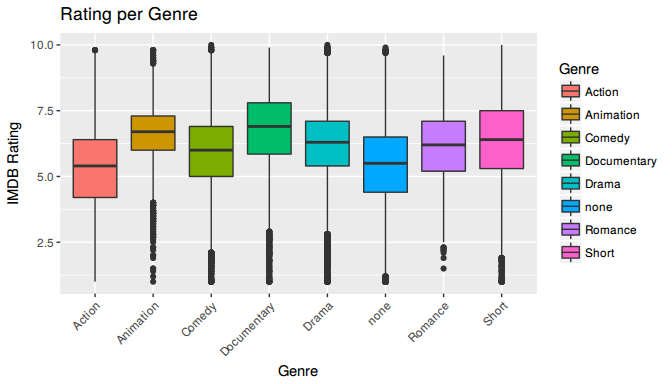

IMDB Movie Explorer (<https://zvonkok.shinyapps.io/data-products-assignment/>)
================
Zvonko Kosic

Sneak Preview
-------------

Why? Exploratory Analysis App
-----------------------------

-   Summarize main characeteristics
-   Seeing what the data can tell us
-   Recognize patterns in advance
-   e.g glampse of how ratings are distributed over genre

<!-- -->

    ## Loading required package: ggplot2

    ## Loading required package: ggplot2movies

------------------------------------------------------------------------

What? Exploratory Analysis App
------------------------------

-   Mainly visualizations of various variables
-   Scatter and bar plots
-   Grid of several variables compared to others

<!-- -->

    ## Warning: Removed 53573 rows containing missing values (geom_point).

------------------------------------------------------------------------

ShinyApp! Exploratory Analysis App
----------------------------------

-   IMDB Movies Database Explorer
-   Visualize the potential dependancy between several variables
-   Limit every variable to specific intervalls
-   Grid plot with a lot of dependent variables at once

------------------------------------------------------------------------

Conclusion. Exploratory Analysis App
------------------------------------

-   John W. Tukey said that too much emphasis was placed on statistical hypothesis testing; more emphasis is/was needed on eploratory analysis
-   Before conducting any regression, prediction exploratory analysis is the first step
-   This app can help greatly to understand the underlying data.
-   Could be expanded to automatically extracts the variables and builds the ui on demand ---
